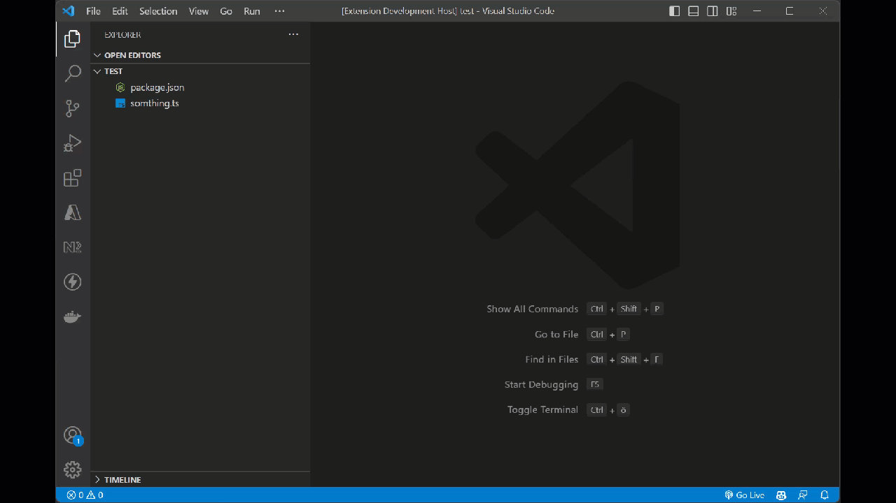

# Work Time Tracker

[Install from Visual Studio Marketplace](https://marketplace.visualstudio.com/items?itemName=S-Mitterlehner.time-tracker-vscode)

A Visual Studio Code extension for tracking your work time.
This extension allows you to track your worktime time, and stores the data in a JSON file in the `.vscode` directory of your workspace. Therefore no external tool is required for your worktime tracking.

## Features

- Track your worktime in a project
- Calculate spent time
- Multiple Projects in a single workspace
- Full control of your worktime-data

## Usage

### Time tracking

To track your time you must be inside a folder or workspace. Then you can start the tracking by entering the command `Time-Tracker: Start Tracking Work Time`. If the tracking has started you should have gotten a `times.json` file in your `.vscode` folder.
To stop the time-tracking you must activate the command `Time-Tracker: Stop Tracking Work Time`. After that you can insert a comment and hit `Enter`. Your time is saved.

To show your spent time, you have to activate the command `Time-Tracker: Total Time Spent`. A Popup with the information should show up.

### Multiple Projects

By default multiple projects are disabled, to keep it simple for most use-cases. However if you want to split your times by projects inside a single folder, change the `allowMultipleProjects` to `true` in your `times.json`.
NOTE: This is only possible with version `2+` (for more information see below).

After you changed the `times.json`, you have to reload the file by activating the command `Time-Tracker: Init` or reopening VS-Code.

Once you activated Multiple Projects you can start a new tracking. If you do, you should be asked to insert a Project-Name.

### Migrate `times.json`

For better flexibility each `times.json` has a version property (except for version 1). This is useful to support breaking changes without changing each `times.json` file.
Therefore it could be, that you have to upgrade the `times.json` to use the newest features (like multiple projects).
You should be asked when you open a folder to migrate to the newest version. However, you can also trigger this by activating the command `Time-Tracker: Migrate Storage File`.

### Productivity Factor

For each `TimeEntry` you can specify the `productivityFactor` in the `times.json`. This factor will be added to the calculated time of each entry. The `default` value is `1`. With this feature you can add a factor to increase or decrease the time you've worked, by percent.
If you want to insert the factor when you stopped tracking, you can activate this by changing the `askForProductivityFactor` property to true in the `times.json` or by calling the command `Time-Tracker: Toggle Ask For Productivity Factor`.

## Commands

| Command                                            | Command-Id                                 | Description                                                                                | `times.json` version support |
| -------------------------------------------------- | ------------------------------------------ | ------------------------------------------------------------------------------------------ | ---------------------------- |
| `Time-Tracker: Init`                               | `time-tracker.init`                        | Initializes the Time-Tracker and reloads the `times.json`. You'll probably never need this | `1`+                         |
| `Time-Tracker: Start Tracking Work Time`           | `time-tracker.startTrackingTime`           | Starts tracking work time for the selected project                                         | `1`+                         |
| `Time-Tracker: Stop Tracking Work Time`            | `time-tracker.stopTrackingTime`            | Stops tracking work time and saves the time spent                                          | `1`+                         |
| `Time-Tracker: Total Time Spent`                   | `time-tracker.totalTimeSpent`              | Displays the total time spent on the selected project (index if not set)                   | `1`+                         |
| `Time-Tracker: Migrate Storage File`               | `time-tracker.migrate`                     | Migrates the Time-Tracker storage file to a new version of the `times.json`                | `2`+                         |
| `Time-Tracker: Allow Multiple Projects`            | `time-tracker.allowMultipleProjects`       | Enables tracking time for multiple projects simultaneously. this cannot be undone.         | `2`+                         |
| `Time-Tracker: Toggle Ask for Productivity Factor` | `time-tracker.toggleAskProductivityFactor` | Toggles whether or not to ask for a productivity factor when stopping the time tracking    | `2`+                         |

## `times.json`

The `times.json` is the storage file of the extension for each workspace. During the development there are different Versions of this file. The `times.json` is fully backwards compatible and can be migrated at all times.

Current Version: [V2](docs/storage/v2.md)

### Older Versions

- [V1](docs/storage/v1.md)

## Contribute

Please refer to the [contribution guidelines](./docs/contributions.md) page.

## Credits

Work Time Tracker was created by [S-Mitterlehner](https://github.com/S-Mitterlehner).

## License

This extension is licensed under the [MIT License](LICENSE).
